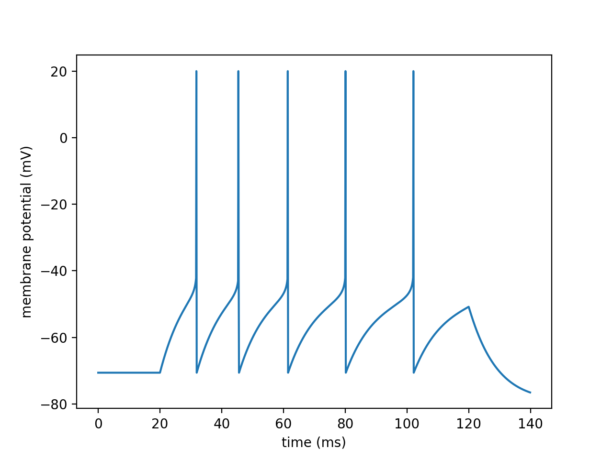
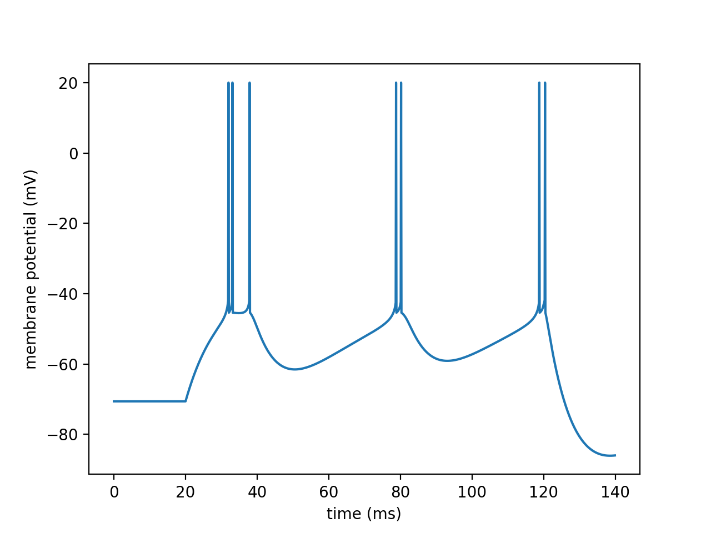
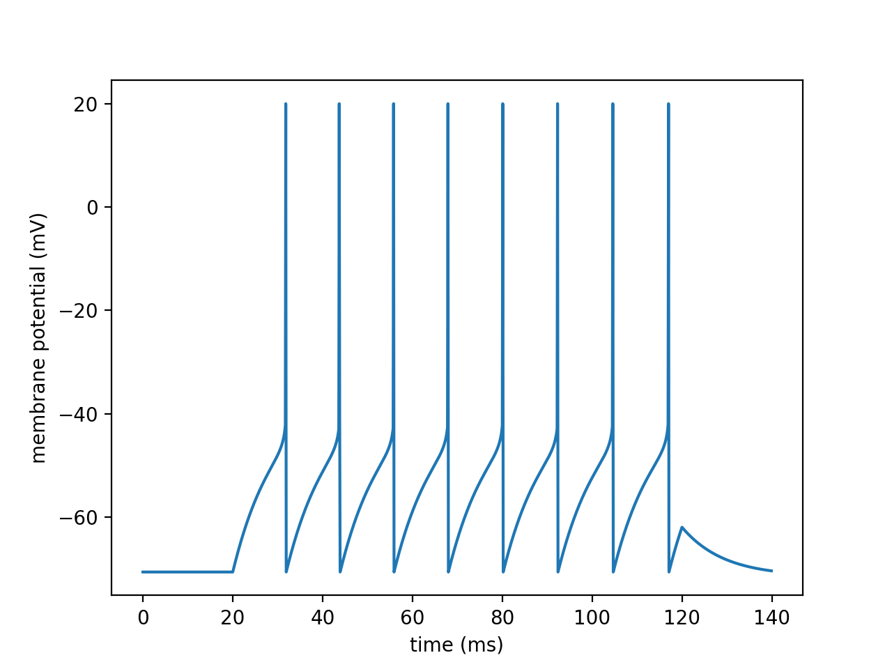
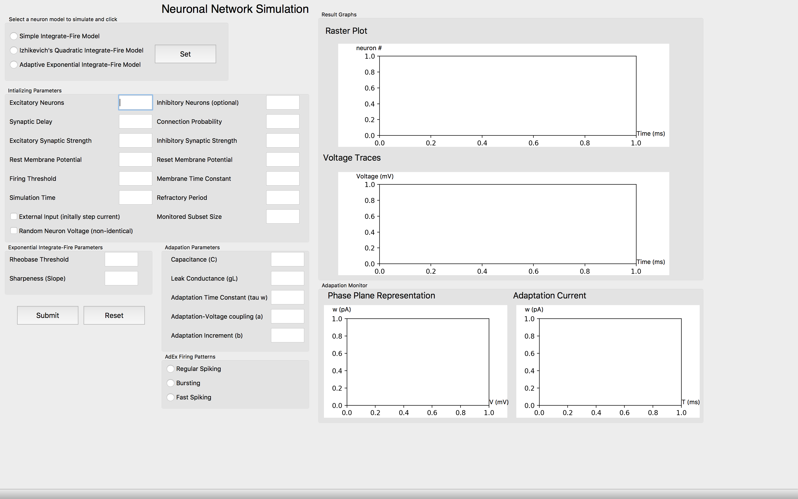
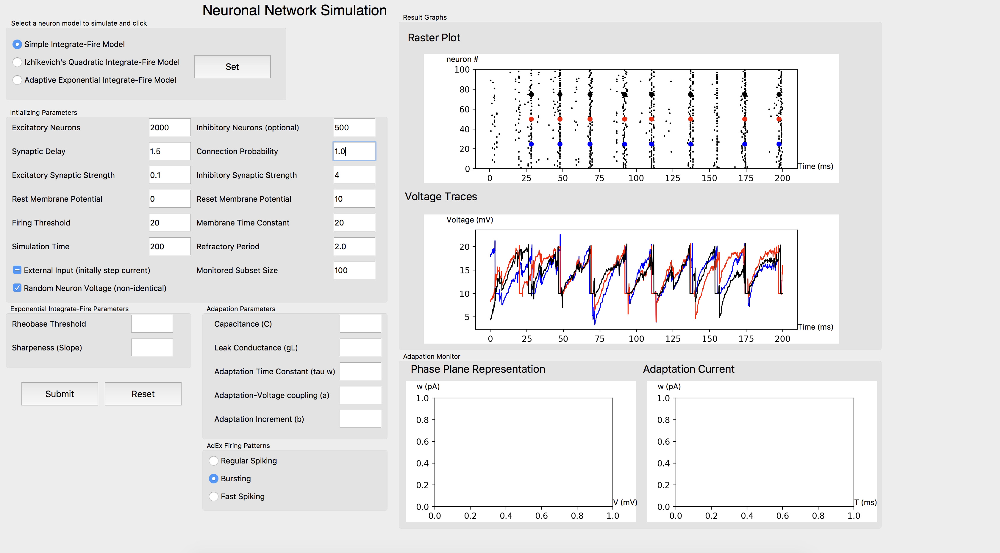
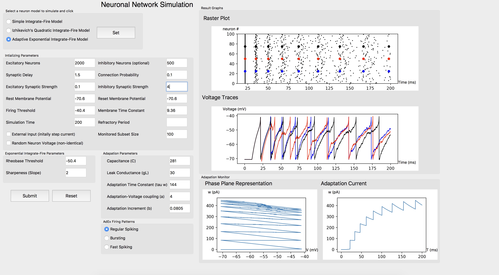
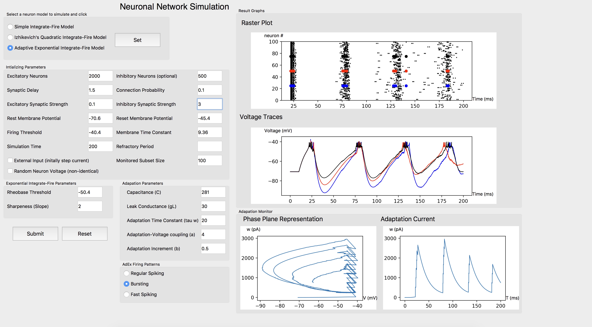
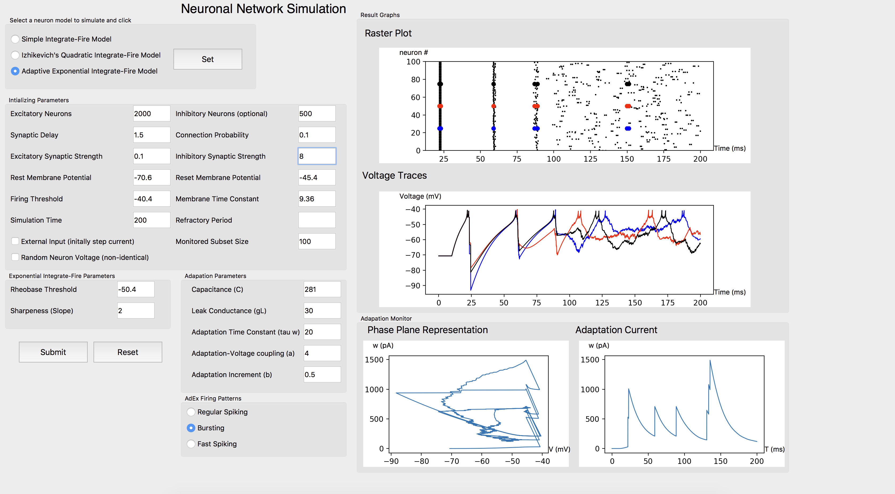
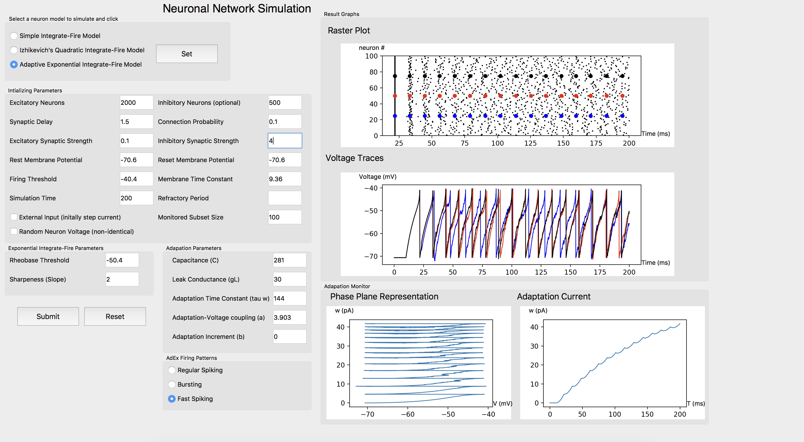

# Models of Neurons and Neuronal Networks

## UoM CS Final Year Project
This project is my final year project for the Department of Computer Science at the University of Manchester.

A Python GUI neuronal network simulator was implemented, and simulations were conducted to analyze
different dynamical behaviors appearing in single neurons or neuronal networks and examine the synchronicity of the system.

## Keywords
* Spiking Neural Network (SNN)
* Brain-Inspired AI
* Computational Neuroscience
* Nonlinear System
* Dynamical System

## Software Tools
* Python3
* [Brain2](https://brian2.readthedocs.io/en/stable/) - Open-soruce Python Simulator for spiking neural networks
* [Neurodynex](https://github.com/EPFL-LCN/neuronaldynamics-exercises) - Python exercises for the book [Neuronal Dynamics](https://neuronaldynamics.epfl.ch/index.html) by Wulfram Gerstner, Werner M. Kistler, Richard Naud and Liam Paninski
* [PyDSTool](https://pypi.org/project/PyDSTool/) - Simulation and analysis environment for dynamical systems models of physical systems (ODEs, DAEs, maps, and hybrid systems)
* [PyQt5](https://pypi.org/project/PyQt5/) - GUI widgets toolkit

## Abstract
*Despite its size, a neuron is a very complicated entity; without sufficient biological and mathematical background knowledge, simulations of the neuronal network is out of reach. 
Therefore, the aim of the thesis is to implement networks of biologically accurate neuron models within computationally feasible cost and to simulate and analyse various electrophysiological behaviours including firing patterns of spiking neurons and the emergence of synchronisation. 
As a result, several mathematical models of single neurons and networks of neurons were explored and simulated. 
In addition to this, the synchronisation property of a network of neurons was analysed in the presence and absence of the background stimuli.*

## Figures
Regular Firing Patterns    | Bursting Firing Patterns  | Fast Firing Patterns
:-------------------------:|:-------------------------:|:-------------------------:
 |  | 

## Result
The final project report of was selected as one of the best papers in 2018 and was published on the Department of Computer Science at the University of Manchester.

The report was written in LaTex via [Overleaf](https://www.overleaf.com/), and the PDF version is included in this repository.

[Project Report](./Lee_Project_Report.pdf)

